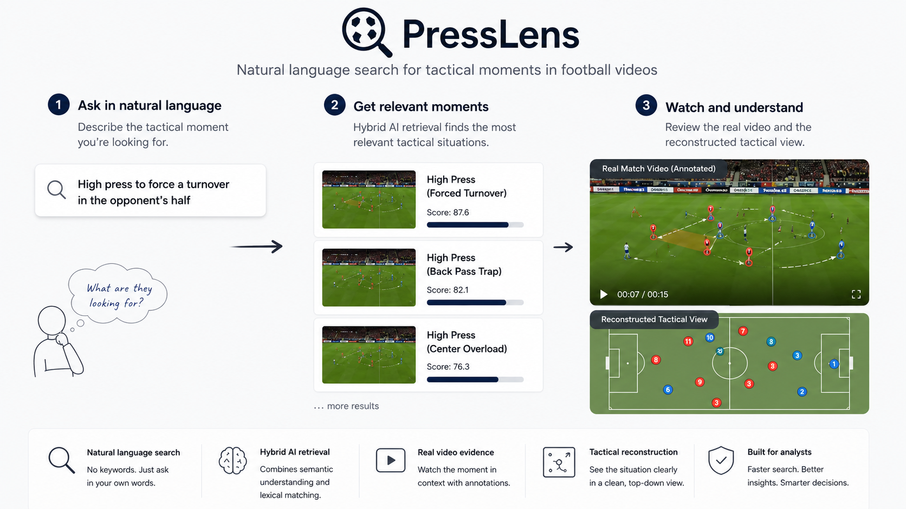

# PressLens



PressLens is a football-intelligence application for retrieving tactical
situations from match video with natural-language queries. It combines
browser-side Arctic text embeddings, BM25 text matching, reconstructed pitch
graphs, and synchronized video evidence.

PressLens is a research prototype rather than a production analysis system.
Its small, reviewed catalogue is intended to demonstrate the end-to-end
workflow and provide inspectable evidence, not to represent match-wide
coverage.

Live application: <https://lqh52.github.io/presslens/>

## The research idea

Coaches, managers, analysts, and players should be able to find a relevant
moment without writing code or learning a database query language. They should
be able to ask for it in everyday football language—for example, “show me a
high press that forces play back inside”—and review the closest match
situations.

Off-the-shelf vision-language models are useful for broad video semantics, but
fine-grained tactical concepts depend on team shape, spacing, pitch location,
pressure around the ball, and movement over time. These distinctions are not
well represented in generic training data, while sufficiently large,
expert-labelled tactical video datasets are expensive to create.

PressLens explores a structure-first alternative. Synthetic player-and-ball
graphs provide controlled examples of tactical patterns. A model can learn
those patterns in normalized pitch space, while game-state reconstruction maps
real broadcast video into the same graph representation. The resulting
tactical class and structural evidence can then support natural-language
retrieval of real video.

The current application is the retrieval and evidence layer of that research
direction. It combines text-embedding similarity with BM25 and presents the
corresponding broadcast and reconstructed tactical views. Learning retrieval
embeddings directly from synthetic and reconstructed graphs is the next
modelling stage.

## What is in this repository?

The public repository contains the Next.js interface, browser retrieval,
deployment catalogue, media integration, and application tests. Dataset
preparation, model training, local review tools, generated graphs, raw video,
annotations, model weights, and credentials are maintained outside the public
product source.

The current research design and interpretation guide are documented in
[RESEARCH.md](RESEARCH.md) and [RESEARCH_NOTES.md](RESEARCH_NOTES.md).

## Use the application

Requirements:

- Node.js 20 or newer
- npm 10 or newer
- Git

Clone and start the development server:

```bash
git clone https://github.com/lqh52/presslens.git
cd presslens
npm install
cp .env.local.example .env.local
npm run dev
```

Open <http://localhost:3000>.

On Windows PowerShell, replace the copy command with:

```powershell
Copy-Item .env.local.example .env.local
```

The example environment file contains no credentials. The development and
build commands automatically restore the committed retrieval catalogue into
`public/demo`.

The first search downloads the quantized
`Snowflake/snowflake-arctic-embed-s` model from Hugging Face and caches it in
the browser. Search then runs locally: 90% normalized embedding cosine
similarity and 10% normalized BM25 lexical relevance. Narrow intent guards
handle explicit negation and abstain for unsupported situations such as set
pieces. The retrieval score is relevance, not probability.

Run the application checks:

```bash
npm test
npm run build
```

## Deploy the application

The hosted version uses:

- GitHub Pages for the static interface and retrieval catalogue;
- object storage for video and image assets;
- Hugging Face for the browser-compatible Arctic embedding model.

See [DEPLOYMENT.md](DEPLOYMENT.md) for setup and update instructions.

## Supported tactical classes

- **High press — wing:** pressure engages high and is concentrated near a
  flank.
- **High press — central:** pressure engages high through central build-up
  lanes.
- **Medium press:** the defending shape engages around the middle third.
- **Low block:** the defending team stays compact near its own penalty area.

The published catalogue contains 15 reviewed examples: six four-second clips
and nine eight-second clips. Each result provides synchronized broadcast and
canonical pitch video with team structure, graph edges, pressure relationships,
and ball position.

## Data and licensing

Dataset access and usage conditions are described on the
[SoccerNet data page](https://www.soccer-net.org/data). Video access may
require an NDA. Footage should be stored and shared in accordance with those
conditions. This repository does not grant rights to redistribute third-party
footage. Before publishing a deployment, replace the example media endpoint
with assets that you are authorized to host and share. Local credentials can
be kept in `.env`, which is ignored by Git.
