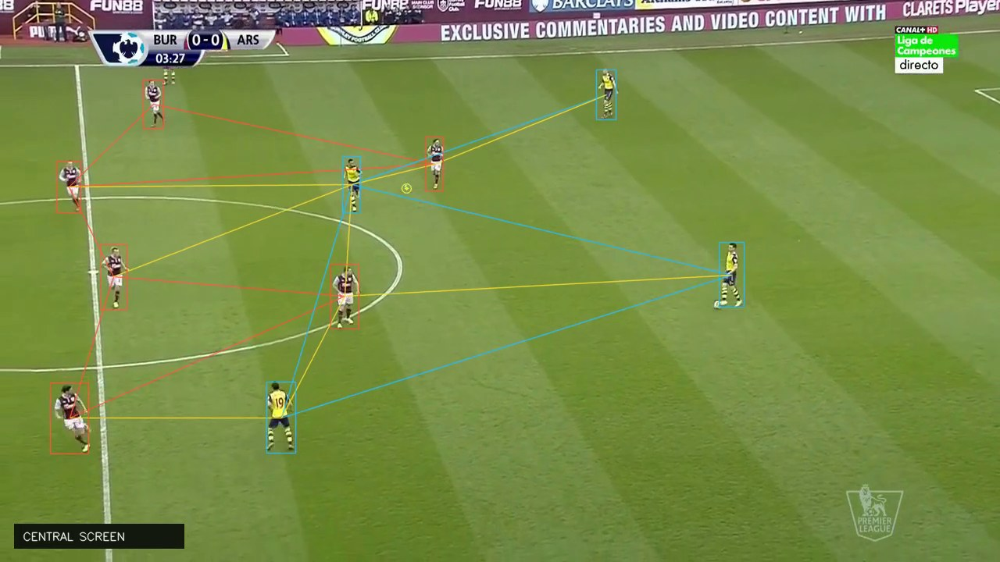
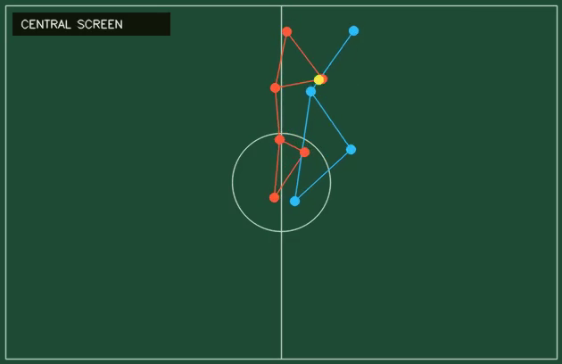

# PressLens research guide

This guide describes how to reproduce and extend the research pipeline on a
normal Linux, macOS, or Windows workstation. A CUDA-capable GPU is useful for
video ranking and model training but is not required for the web application.

## 1. Scientific objective

### Football question

> How can coaches, managers, analysts, and players find the most relevant
> tactical video simply by describing the situation in everyday football
> language?

A useful system should understand requests such as “show me a high press that
forces the centre-back towards the touchline” and return moments with the right
team shape, pitch location, pressure, and direction—not merely clips that share
similar words or visual appearance.

### Why generic video-language retrieval is insufficient

Off-the-shelf vision-language models learn broad semantic associations from
large, general-purpose datasets. They can recognize a football match, a player,
or an action, but fine-grained tactical situations are defined by relationships
between players and the ball:

- the relative shape of the two teams;
- distances and passing lanes around the ball;
- where the situation occurs on the pitch;
- which team is in possession and its attacking direction;
- how this structure changes over a short sequence.

These signals may occupy only a small part of the image and can look different
across camera angles, stadiums, kits, and broadcast styles. A domain-specific
embedding would therefore be preferable, but training one requires tactical
video–text pairs or expert class labels that are not available at useful scale.

### Creating supervision from tactical structure

Tactical recognition does not necessarily require a dense description of every
pixel. For the pressing situations studied here, much of the relevant
information can be represented as a pitch-normalized graph:

- nodes represent players and the ball;
- node attributes represent team, position, velocity, and possession;
- edges represent proximity, team shape, pressure, or available connections;
- temporal graph sequences represent how the situation develops.

Synthetic graphs make it possible to generate controlled variations of known
tactical structures without first labelling thousands of broadcast clips.
They can vary spacing, formation, ball position, pressure intensity, attacking
direction, and observation noise while retaining the intended tactical class.
A graph model can then learn structural prototypes and decision boundaries from
this synthetic supervision.

### Connecting synthetic structure to real video

Game-state reconstruction maps real broadcast video into the same normalized
player-and-ball graph space. The research problem then becomes a transfer
problem: determine whether a model trained on synthetic tactical structures can
recognize corresponding patterns in reconstructed match sequences despite
tracking, calibration, identity, and possession errors.

#### Annotated broadcast frame



#### Canonical tactical graph



**Figure 1. From broadcast video to tactical structure.** The first panel shows
the detected players and reconstructed within-team relationships in a reviewed
central-screen excerpt. The second panel projects the same moment into
canonical pitch coordinates, reducing the influence of camera perspective, kit
appearance, and stadium background. Boxes, team identities, ball location, and
edges are model-derived estimates rather than manual ground-truth annotations.

The full research path is:

1. define tactical classes as graph structures with football experts;
2. generate diverse synthetic graph sequences for each structure;
3. train a graph or temporal-graph classifier and embedding model;
4. reconstruct graphs from real match video;
5. classify or embed each real sequence in the learned tactical space;
6. align tactical structures with descriptions in everyday football language;
7. retrieve and present the most relevant real clips with visual evidence.

### Current implementation and research hypothesis

The current application implements the final retrieval and evidence interface.
It uses MiniLM text embeddings and BM25 over structured descriptions attached
to reviewed clips. It does not yet claim a learned tactical embedding from
synthetic graphs.

The next modelling stage tests the central hypothesis:

> A tactical representation learned from synthetic, pitch-normalized graph
> sequences can improve fine-grained retrieval and classification of real
> pressing situations when compared with generic video-language, text-only,
> and geometry-only baselines.

The system therefore separates two evaluation tasks:

- **Tactical classification:** assign a reconstructed sequence to a tactical
  class.
- **Text-to-sequence retrieval:** rank reviewed sequences for a natural-language
  query.

The supported classes are central screen, high press, and no local pressure.
Left and right touchline traps should be treated as experimental until enough
reviewed examples exist.

## 2. Recommended experimental design

Use match-level splits, with each match assigned to only one of training,
validation, or evaluation.

Recommended comparisons:

1. BM25 text matching;
2. text-embedding cosine similarity;
3. hybrid BM25 plus cosine retrieval;
4. video-only temporal representation;
5. geometry-only graph representation;
6. fused video, text, and graph representation.

Report:

- Recall@1, Recall@5, and Recall@10;
- mean reciprocal rank and mean average precision;
- macro F1 and per-class precision/recall for classification;
- calibration error or reliability plots for model confidence;
- results by camera view, player visibility, possession reliability, and match;
- bootstrap confidence intervals over matches.

Weak-label agreement and human tactical accuracy are separate measurements.
Weak labels are training signals; tactical accuracy requires blinded human
review.

## 3. System requirements

Install:

- Git
- Python 3.10 or 3.11
- Node.js 20 or newer
- FFmpeg

Linux:

```bash
sudo apt update
sudo apt install git python3 python3-venv ffmpeg
```

macOS with Homebrew:

```bash
brew install git python ffmpeg node
```

Windows users can install Git, Python, Node.js, and FFmpeg with `winget`, then
run the commands below in PowerShell or Git Bash.

## 4. Create the research environment

Clone the repository and create a virtual environment:

```bash
git clone https://github.com/lqh52/presslens.git
cd presslens
python3 -m venv .venv
```

Activate it:

```bash
# Linux and macOS
source .venv/bin/activate

# Windows PowerShell
.\.venv\Scripts\Activate.ps1
```

Upgrade packaging tools and install the research dependencies:

```bash
python -m pip install --upgrade pip setuptools wheel
python -m pip install -r requirements-research.txt
```

For GPU training, install the PyTorch build recommended for the CUDA version on
your workstation before installing the remaining requirements. Confirm the
environment:

```bash
python -c "import torch; print(torch.__version__, torch.cuda.is_available())"
ffmpeg -version
```

## 5. Obtain SoccerNet data

The [SoccerNet data page](https://www.soccer-net.org/data) explains dataset
access, the Python client, and the NDA process for video. Store access
credentials outside source control and keep downloaded media in the ignored
`data/raw` directory.

Game State Reconstruction resources are available from the
[official task page](https://www.soccer-net.org/tasks/game-state-reconstruction)
and the
[SoccerNet Game State Reconstruction repository](https://github.com/SoccerNet/sn-gamestate).

Install or update the SoccerNet client:

```bash
python -m pip install --upgrade SoccerNet
```

Download through the project helper:

```bash
python scripts/download_soccernet_matches.py --help
```

The helper prompts for the video password rather than requiring it in source
code. Store downloaded matches under:

```text
data/raw/soccernet/<league>/<season>/<game>/
```

For SoccerNet Game State Reconstruction labels, place extracted
`Labels-GameState.json` files under a separate directory such as:

```text
data/raw/gamestate-2025/labels/
```

All directories under `data/raw` are ignored by Git.

## 6. Candidate generation and video-language ranking

Generate high-recall candidate windows from a match:

```bash
python scripts/build_candidates.py \
  --game-dir "data/raw/soccernet/<league>/<season>/<game>" \
  --output data/manifests/candidates.json
```

Rank candidates using X-CLIP:

```bash
python scripts/rank_video_candidates.py \
  --manifest data/manifests/candidates.json \
  --output data/manifests/ranked_candidates.json \
  --batch-size 8 \
  --top-k 80 \
  --balanced
```

On a multi-GPU workstation, select a device with `CUDA_VISIBLE_DEVICES`; on CPU,
reduce the batch size. Extract a manageable review set:

```bash
python scripts/extract_ranked_clips.py --limit 50
python scripts/annotation_server.py
```

Open the URL printed by the annotation server in a browser. The server binds to
the loopback interface by default.

## 7. Build game-state graphs

Convert SoccerNet-GSR labels to the 23-node, 13-feature representation:

```bash
python scripts/convert_gamestate_graphs.py \
  --labels-dir data/raw/gamestate-2025/labels/train \
  --output data/graphs/gsr_train.npz \
  --stride 5

python scripts/convert_gamestate_graphs.py \
  --labels-dir data/raw/gamestate-2025/labels/valid \
  --output data/graphs/gsr_valid.npz \
  --stride 5
```

The graph contains player and ball locations, motion, team assignment, role,
ball-control evidence, visibility masks, and possession metadata. Possession is
inferred from the player nearest the ball; it is not supplied tactical ground
truth.

## 8. Synthetic pretraining and weak supervision

Synthetic graphs provide a representation and implementation sanity check:

```bash
python scripts/generate_synthetic_graphs.py
python scripts/train_graph_classifier.py
python scripts/classify_gamestate_graphs.py \
  --graphs data/graphs/gsr_valid.npz \
  --output data/graphs/gsr_valid_predictions.jsonl
```

Weak supervision translates tactical definitions into inspectable geometric
rules, including pressure radii, motion toward the ball, central-corridor
screening, and touchline containment:

```bash
python scripts/derive_weak_tactical_labels.py \
  --graphs data/graphs/gsr_train.npz \
  --output data/graphs/gsr_train_weak.npz

python scripts/derive_weak_tactical_labels.py \
  --graphs data/graphs/gsr_valid.npz \
  --output data/graphs/gsr_valid_weak.npz

python scripts/train_weak_graph_classifier.py --confidence 0.7
```

Ambiguous states, uncertain possession, invalid projections, set pieces, and
unusable camera views should be excluded rather than forced into a class.

## 9. Full-video game-state reconstruction

The upstream SoccerNet Game State Reconstruction implementation has its own
dependency requirements. Install it in a separate environment by following its
official repository instructions. Keep that environment independent from
`.venv`.

After producing a TrackLab state, convert it:

```bash
python scripts/convert_tracklab_state.py \
  --state path/to/tracklab-state.pklz \
  --video path/to/source-clip.mp4 \
  --yolo path/to/yolo11m.pt \
  --output data/graphs/reconstructed.npz \
  --recluster-teams \
  --match-registry data/annotations/team_identity_registry.example.json \
  --match-id "<exact SoccerNet game ID>"
```

For a new fixture:

1. create a match-scoped registry entry;
2. verify the two appearance clusters against the kits;
3. specify fixed attacking directions for each half;
4. review referees, substitutes, goalkeepers, and pitch-external detections;
5. keep the registry status `unreviewed` until identities are checked.

Team-identity calibration is fixture-specific; a model trained for one kit
combination is not assumed to transfer to another.

## 10. Direction and team-identity calibration

Attack direction is treated as constant within a match half. The canonical
pitch therefore uses one reviewed orientation rather than rotating after
per-frame possession changes. Use:

```bash
python scripts/calibrate_attack_directions.py --help
python scripts/build_team_review_set.py --help
python scripts/train_team_identity.py --help
```

The canonical renderer locks orientation to the reviewed representative frame
for the entire excerpt. Team-identity filtering conservatively removes
goalkeepers, referees, touchline substitutes, off-pitch detections, short
unstable tracks, and strong appearance outliers.

## 11. Human review

Create a stratified review set:

```bash
python scripts/build_expert_review_set.py
python scripts/graph_review_server.py
```

For reconstructed tactical clips:

```bash
python scripts/build_expanded_review_pool.py --help
python scripts/expanded_review_server.py
```

Recommended annotation fields include:

- include, exclude, or uncertain;
- tactical class;
- possession team;
- pressing team;
- attacking direction;
- camera-view suitability;
- exclusion reason.

Keep annotators blind to retrieval rank and model confidence when measuring
human agreement or model accuracy.

## 12. Evaluation

Run retrieval evaluation:

```bash
python scripts/evaluate_retrieval.py --help
```

Use a held-out match split and save the exact manifest, model checksum, query
set, class definitions, and evaluation code with every result. Perform error
analysis for:

- possession switches;
- left/right ambiguity;
- missing or duplicated players;
- referee and substitute detections;
- camera cuts and close-ups;
- incorrect pitch calibration;
- class imbalance.

## 13. Export reviewed examples to the application

After review decisions are final:

```bash
python scripts/build_reviewed_web_demo.py
npm run prepare:deploy
```

The web builder removes obsolete files only from `public/demo`. Raw video,
graphs, tracking states, and annotations remain under ignored research
directories.

Follow [DEPLOYMENT.md](DEPLOYMENT.md) to upload the retained media and deploy
the static application.

## 14. Reproducibility checklist

Record:

- repository commit;
- Python and package versions;
- GPU model and CUDA version, when used;
- SoccerNet release and match IDs;
- train/validation/test match split;
- random seeds;
- label-function version;
- class definitions;
- model and dataset checksums;
- reviewer protocol and agreement;
- exclusions and failure cases.

SoccerNet footage and derived artifacts should be distributed according to the
applicable dataset agreement. Access credentials remain outside the repository.
